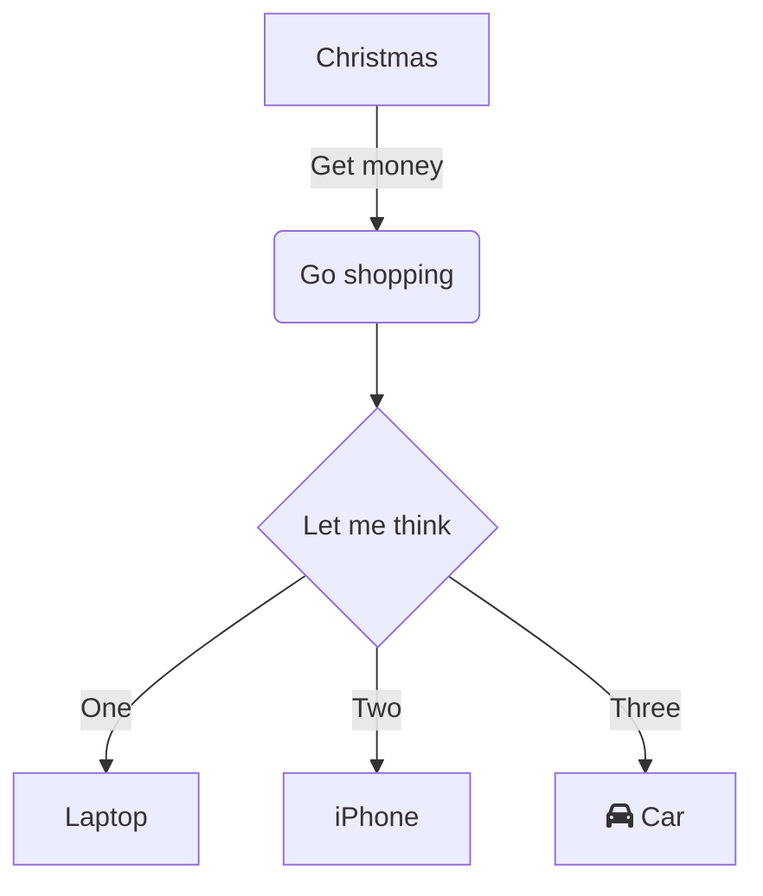
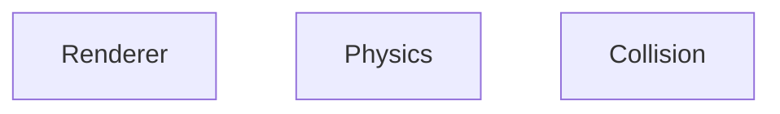

# Architecture

# Design
Dedicated state manager?

-
-

# TODO
- Gravity: https://gamedev.stackexchange.com/questions/15708/how-can-i-implement-gravity/41917#41917
- Networking support, work on next to help guide design
  - Create wormhole mock to test this
- Multi-layer collision detection.
  - AABB first, then circle etc
- Add optional render for spatial hashmap
- Update engine to use percentages by default
    - Why? To support arbitrary resolution, easier debugging, intuitive coordinates

## OR Pong mock

## Wormhole mock
Design:
- Wormhole in center
- enemies spawn out of wormhole every X seconds, very basic AI to move straight towards player
- Every client who connects gets attached to same game (for now)
- Any shots into wormhole come out on other side of all players (basic shooting)
- If player is hit, they die, their world is torn down

Connection Flow (Keep it simple)
- One game is always active
- Client joins singleton game
- upon joining the server creates an instance of the game for them
- Server sends payload that represents game world to client
  - e.g. { wormhole: coords, player: coords }
- Client initializes render of world given initial coordinates
- When mouse is moved, client does physics to move player, and sends message to server to indicate mouse position.
- (?) Server mocks all input events through same input manager system?
  - Or does server just accept client's position if movement is realistic?
- Client "jumps" to server supplied coordinates
  - How to prevent snapback?

## Resources
https://gamedev.stackexchange.com/questions/79446/game-server-client-user-input-event-handling

netcode.io

https://gamedev.stackexchange.com/questions/28820/how-do-i-sync-multiplayer-game-state-more-efficiently-than-full-state-updates

## Assets
https://www.spriters-resource.com/snes/metalwarriors/
