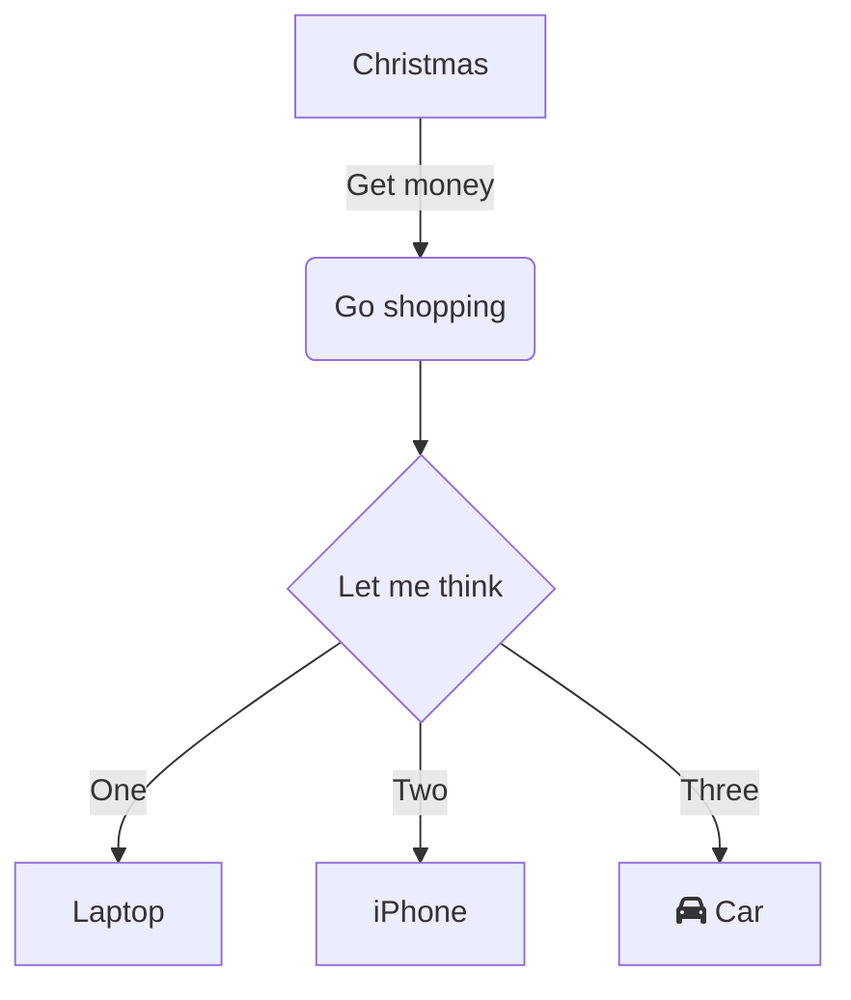
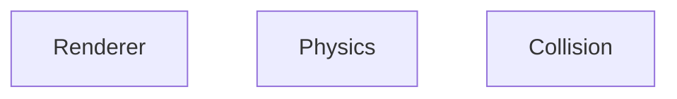

# Architecture

# Design
Dedicated state manager?

-
-

# TODO
- Networking support, work on next to help guide design
- Multi-layer collision detection.
  - AABB first, then circle etc
- Add optional render for spatial hashmap
- Update engine to use percentages by default
    - Why? To support arbitrary resolution, easier debugging, intuitive coordinates
