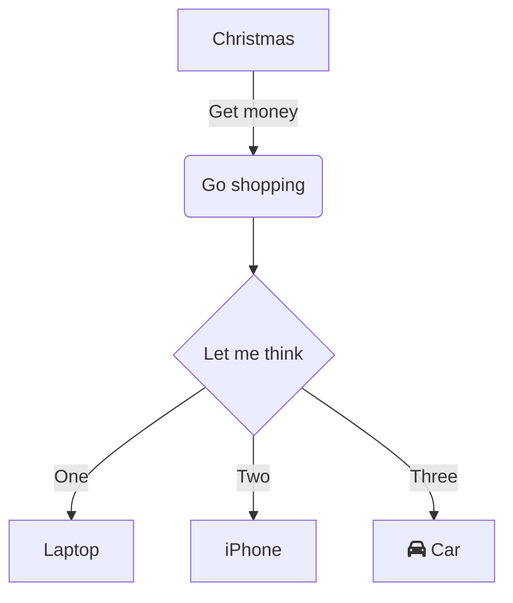
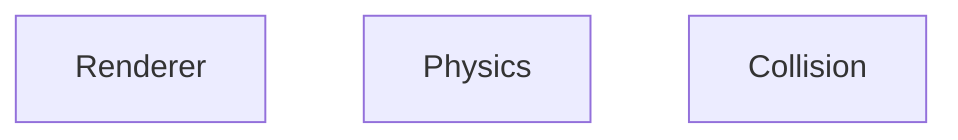

# Architecture

# TODO
- What order should game run things in?
    - e.g. Collision detection before update?
- Recommended state management approach?
- Add optional render for spatial hashmap
- Update engine to use percentages by default
    - Why? To support arbitrary resolution, easier debugging, intuitive coordinates
